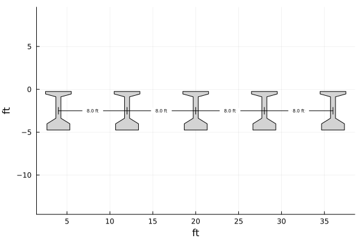
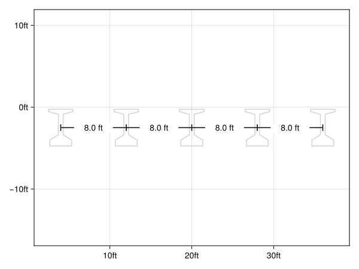

# TapeMeasure
[](image.png)  

[](https://co1emi11er2.github.io/TapeMeasure.jl/stable/)
[](https://co1emi11er2.github.io/TapeMeasure.jl/dev/)
[](https://github.com/co1emi11er2/TapeMeasure.jl/actions/workflows/CI.yml?query=branch%3Amain)
[](https://ci.appveyor.com/project/co1emi11er2/TapeMeasure-jl)
[](https://codecov.io/gh/co1emi11er2/TapeMeasure.jl)
[](https://coveralls.io/github/co1emi11er2/TapeMeasure.jl?branch=main)

# TapeMeasure.jl

TapeMeasure.jl is a Julia package for handling physical dimensions and units in scientific computing. It provides a robust framework for defining, converting, and manipulating dimensions, ensuring that calculations are dimensionally consistent.

## Installation

To install TapeMeasure.jl, use the Julia package manager:

```julia
using Pkg
Pkg.add("TapeMeasure")
```

## Usage

Here's a basic example of how to use TapeMeasure.jl:

```julia
using TapeMeasure
using Unitful

const ft = u"ft"

# Define a few objects consisting of x and y coordinates
 x = [
	 [2.5ft, 2.5ft, 3.7083333329999997ft, 3.7083333329999997ft, 2.666666667ft, 2.666666667ft, 5.333333333000001ft, 5.333333333000001ft, 4.291666667ft, 4.291666667ft, 5.5ft, 5.5ft, 2.5ft],
	 [10.5ft, 10.5ft, 11.708333333ft, 11.708333333ft, 10.666666667ft, 10.666666667ft, 13.333333333ft, 13.333333333ft, 12.291666667ft, 12.291666667ft, 13.5ft, 13.5ft, 10.5ft],
	 [18.5ft, 18.5ft, 19.708333333ft, 19.708333333ft, 18.666666667ft, 18.666666667ft, 21.333333333ft, 21.333333333ft, 20.291666667ft, 20.291666667ft, 21.5ft, 21.5ft, 18.5ft],
	 [26.5ft, 26.5ft, 27.708333333ft, 27.708333333ft, 26.666666667ft, 26.666666667ft, 29.333333333ft, 29.333333333ft, 28.291666667ft, 28.291666667ft, 29.5ft, 29.5ft, 26.5ft],
	 [34.5ft, 34.5ft, 35.708333333ft, 35.708333333ft, 34.666666667ft, 34.666666667ft, 37.333333333ft, 37.333333333ft, 36.291666667ft, 36.291666667ft, 37.5ft, 37.5ft, 34.5ft]
 ]

y = [
	[-0.25ft, -0.541666667ft, -0.875ft, -3.375ft, -4.020833333000001ft, -4.75ft, -4.75ft, -4.020833333000001ft, -3.375ft, -0.875ft, -0.541666667ft, -0.25ft, -0.25ft],
	[-0.25ft, -0.541666667ft, -0.875ft, -3.375ft, -4.020833333000001ft, -4.75ft, -4.75ft, -4.020833333000001ft, -3.375ft, -0.875ft, -0.541666667ft, -0.25ft, -0.25ft],
	[-0.25ft, -0.541666667ft, -0.875ft, -3.375ft, -4.020833333000001ft, -4.75ft, -4.75ft, -4.020833333000001ft, -3.375ft, -0.875ft, -0.541666667ft, -0.25ft, -0.25ft],
	[-0.25ft, -0.541666667ft, -0.875ft, -3.375ft, -4.020833333000001ft, -4.75ft, -4.75ft, -4.020833333000001ft, -3.375ft, -0.875ft, -0.541666667ft, -0.25ft, -0.25ft],
	[-0.25ft, -0.541666667ft, -0.875ft, -3.375ft, -4.020833333000001ft, -4.75ft, -4.75ft, -4.020833333000001ft, -3.375ft, -0.875ft, -0.541666667ft, -0.25ft, -0.25ft]
]

dims = h_dimension(x, y)

plot(x, y, seriestype=:shape, color=:lightgrey, legend=false, aspectratio=1)
plot!(dims)
```
[](image.png)  

*Can work similarly with Makie*

```julia
using TapeMeasure
using Unitful
using CairoMakie
uc = Makie.UnitfulConversion(ft)

# skipping object and dimension creation.. see above
f = Figure()
ax = Axis(f[1,1], autolimitaspect=1, dim1_conversion=uc, dim2_conversion=uc)
lines!.(ax, x, y, color=:lightgrey)
plot!(ax, dims)
f
```
[](image.png)

## Features

- Makes dimensioning easy
- Works with Unitful
- Dimensional consistency checks

## Roadmap
- [ ] Integrate with Meshes ecosystem
- [ ] Add angle dimensions

## Contributing

Contributions are welcome! Please open an issue or submit a pull request on GitHub.

## License

This project is licensed under the MIT License. See the [LICENSE](LICENSE) file for details.

## Acknowledgements

Thanks to the Julia community and the amazing Plots and Makie packages.

